# SyntaxNodes - Image Processing Effects for ComfyUI

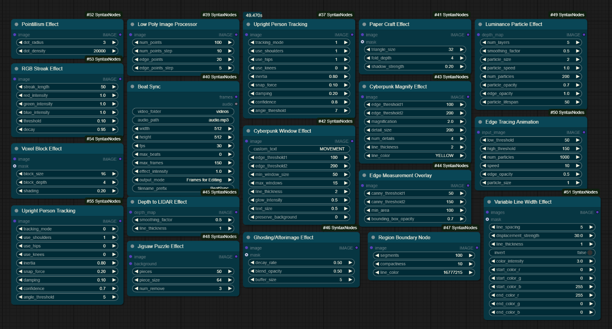 <!-- Replace with path to your overview image -->

A collection of custom nodes for ComfyUI designed to apply various image processing effects, stylizations, and analyses.

## Features

This pack includes the following nodes:

**Stylization & Effects:**

*   [Voxel Block Effect](#voxel-block-effect)
*   [RGB Streak Effect](#rgb-streak-effect)
*   [Cyberpunk Window Effect](#cyberpunk-window-effect)
*   [Cyberpunk Magnify Effect](#cyberpunk-magnify-effect)
*   [Variable Line Width Effect](#variable-line-width-effect)
*   [Jigsaw Puzzle Effect](#jigsaw-puzzle-effect)
*   [Low Poly Image Processor](#low-poly-image-processor)
*   [Pointillism Effect](#pointillism-effect)
*   [Paper Craft Effect](#paper-craft-effect)
*   [Ghosting/Afterimage Effect](#ghostingafterimage-effect)
*   [Luminance-Based Lines](#luminance-based-lines)

**Analysis & Visualization:**

*   [Edge Tracing Animation](#edge-tracing-animation)
*   [Edge Measurement Overlay](#edge-measurement-overlay)
*   [Luminance Particle Effect](#luminance-particle-effect)
*   [Depth to LIDAR Effect](#depth-to-lidar-effect)
*   [Region Boundary Node](#region-boundary-node)

**Utility & Synchronization:**

*   [Beat Sync](#beat-sync)
*   [Upright Person Tracking](#upright-person-tracking)

## Installation

1.  Navigate to your ComfyUI `custom_nodes` directory:
    *   `cd ComfyUI/custom_nodes/`
2.  Clone this repository:
    *   `git clone https://github.com/dream-computing/syntax_nodes.git`
3.  Restart ComfyUI.

*(to-do: Add instructions for installation via ComfyUI Manager.)*

## Nodes Reference

Below are details and examples for each node:

---

### Voxel Block Effect

Applies a 3D pixelated (voxel) effect to the image.

**Parameters:**
*   `image`: Input image.
*   `mask` (optional): Mask to limit the effect area.
*   `block_size`: Size of the voxel blocks.
*   `block_depth`: Depth simulation for the blocks.
*   `shading`: Amount of shading applied to simulate depth.

**Example:**
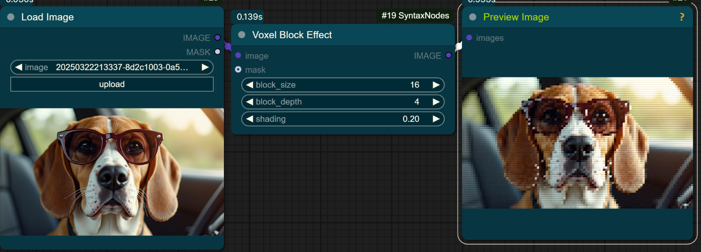 <!-- Replace with path to your example image -->

---

### RGB Streak Effect

Creates horizontal glitch-like streaks based on pixel brightness in RGB channels.

**Parameters:**
*   `image`: Input image.
*   `streak_length`: Maximum length of the streaks.
*   `red_intensity`, `green_intensity`, `blue_intensity`: Multiplier for streak length based on channel brightness.
*   `threshold`: Luminance threshold below which pixels won't generate streaks.
*   `decay`: How quickly streaks fade with distance.

**Example:**
 <!-- Replace with path to your example image -->

---

### Cyberpunk Window Effect

Overlays futuristic UI window elements onto detected edges or regions of interest.

**Parameters:**
*   `image`: Input image.
*   `custom_text`: Text to display within the windows.
*   `edge_threshold1`, `edge_threshold2`: Canny edge detection thresholds.
*   `min_window_size`: Minimum size for a detected window area.
*   `max_windows`: Maximum number of windows to draw.
*   `line_thickness`: Thickness of the window borders.
*   `glow_intensity`: Intensity of the outer glow effect (if any).
*   `text_size`: Size of the displayed text.
*   `preserve_background`: Whether to keep the original image visible (1) or use a black background (0).

**Example:**
 <!-- Replace with path to your example image -->

---

### Cyberpunk Magnify Effect

Creates magnified inset views ("detail windows") focusing on specific parts of the image, often highlighted by lines pointing to the original location.

**Parameters:**
*   `image`: Input image.
*   `edge_threshold1`, `edge_threshold2`: Canny edge detection thresholds (likely used to find points of interest).
*   `magnification`: Zoom factor for the detail windows.
*   `detail_size`: Size of the square detail windows.
*   `num_details`: Number of detail windows to generate.
*   `line_thickness`: Thickness of connecting lines and window borders.
*   `line_color`: Color of the connecting lines.

**Example:**
 <!-- Replace with path to your example image -->

---

### Variable Line Width Effect

Draws horizontal lines across the image, displacing them vertically based on image content and varying color along the line.

**Parameters:**
*   `images`: Input image(s).
*   `mask` (optional): Mask to limit effect area.
*   `line_spacing`: Vertical distance between lines.
*   `displacement_strength`: How much image content affects vertical line position.
*   `line_thickness`: Thickness of the lines.
*   `invert`: Invert the displacement effect.
*   `color_intensity`: How strongly image color influences line color.
*   `start_color_r/g/b`: Starting color components for the gradient.
*   `end_color_r/g/b`: Ending color components for the gradient.

**Example:**
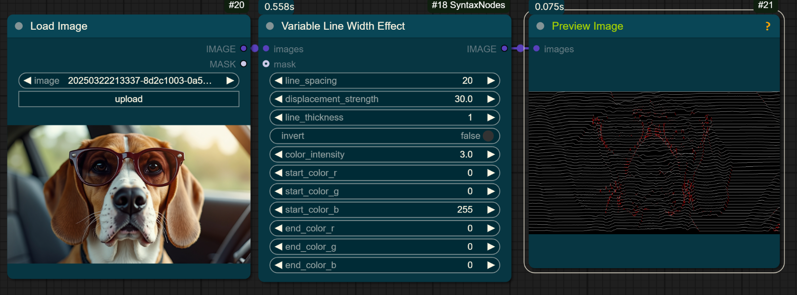 <!-- Replace with path to your example image -->

---

### Jigsaw Puzzle Effect

Transforms the image into a jigsaw puzzle grid, with options to remove pieces.

**Parameters:**
*   `image`: Input image.
*   `background` (optional): Image to use as background where pieces are removed.
*   `pieces`: Number of pieces along one dimension (total pieces = `pieces` * `pieces`).
*   `piece_size`: Size of each puzzle piece (may override `pieces` or work with it).
*   `num_remove`: Number of random pieces to remove.

**Example:**
 <!-- Replace with path to your example image -->

---

### Low Poly Image Processor

Converts the image into a stylized low-polygon representation using Delaunay triangulation.

**Parameters:**
*   `image`: Input image.
*   `num_points`: Number of initial points for triangulation.
*   `num_points_step`: Step related to point density or refinement.
*   `edge_points`: Number of points placed along detected edges.
*   `edge_points_step`: Step related to edge point density.

**Example:**
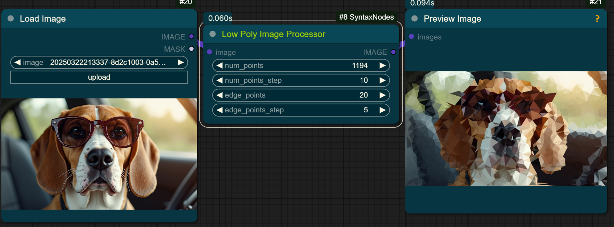 <!-- Replace with path to your example image -->

---

### Pointillism Effect

Recreates the image using small dots of color, mimicking the Pointillist art style.

**Parameters:**
*   `image`: Input image.
*   `dot_radius`: Radius of the individual dots.
*   `dot_density`: Number of dots to generate (higher means denser).

**Example:**
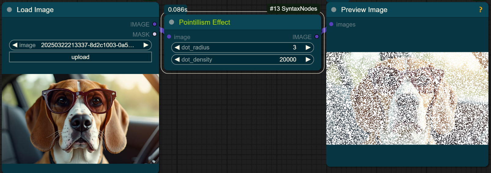 <!-- Replace with path to your example image -->

---

### Paper Craft Effect

Applies a filter that makes the image look like it's constructed from folded geometric triangles.

**Parameters:**
*   `image`: Input image.
*   `mask` (optional): Mask to limit the effect area.
*   `triangle_size`: Size of the triangular facets.
*   `fold_depth`: Intensity of the simulated folds/shading between triangles.
*   `shadow_strength`: Strength of the drop shadow effect.

**Example:**
 <!-- Replace with path to your example image -->

---

### Ghosting/Afterimage Effect

Creates trailing or faded copies of the image, simulating motion blur or afterimages.

**Parameters:**
*   `image`: Input image.
*   `mask` (optional): Mask to limit effect area.
*   `decay_rate`: How quickly the ghost images fade.
*   `offset`: Displacement of the ghost images.
*   `buffer_size`: Number of previous frames/states to use for ghosting.

**Example:**
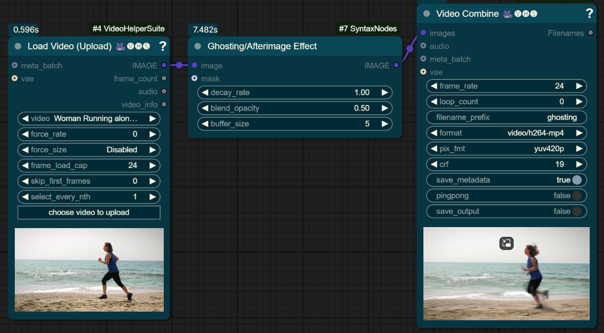 <!-- Replace with path to your example image -->

---

### Edge Tracing Animation

Visualizes image edges using animated particles that move along detected contours. *(Note: Example shows a static frame, animation occurs over time/frames)*.

**Parameters:**
*   `input_image`: Input image.
*   `low_threshold`, `high_threshold`: Canny edge detection thresholds.
*   `num_particles`: Total number of particles to simulate.
*   `speed`: Speed at which particles move along edges.
*   `edge_opacity`: Opacity of the underlying detected edges (if drawn).
*   `particle_size`: Size of the individual particles.
*   `particle_opacity`: Opacity of the particles.
*   `particle_lifespan`: How long each particle exists (relevant for animation).

**Example:**
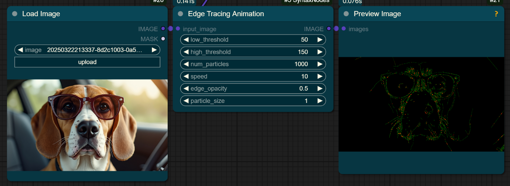 <!-- Replace with path to your example image -->

---

### Edge Measurement Overlay

Detects contours using Canny edge detection and draws bounding boxes around them.

**Parameters:**
*   `image`: Input image.
*   `canny_threshold1`, `canny_threshold2`: Canny edge detection thresholds.
*   `min_area`: Minimum area for a contour to be considered.
*   `bounding_box_opacity`: Opacity of the drawn bounding boxes.

**Example:**
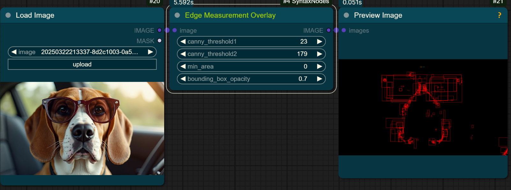 <!-- Replace with path to your example image -->

---

### Luminance Particle Effect

Generates particles whose distribution and possibly appearance are based on the luminance (brightness) of the input image/depth map.

**Parameters:**
*   `depth_map`: Input image (interpreted as brightness/depth).
*   `num_layers`: Number of depth layers for particle generation.
*   `smoothing_factor`: Smoothing applied to the input map.
*   `particle_size`: Size of the particles.
*   `particle_speed`: Speed factor (when used for a batch of image).
*   `num_particles`: Total number of particles.
*   `particle_opacity`: Opacity of the particles.
*   `edge_opacity`: Opacity for edge enhancement.
*   `particle_lifespan`: Duration particles exist (for animation).

**Example:**
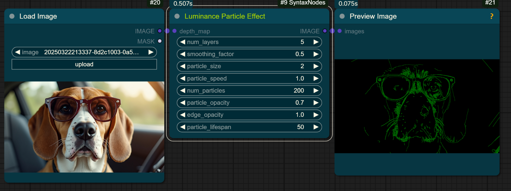 <!-- Replace with path to your example image -->

---

### Depth to LIDAR Effect

Quite literally a delay effect for edge detection. This is a WIP node that may change course over time, but in its current state simply takes a batch of images and provides a delay effect for its edge detection.

**Parameters:**
*   `depth_map`: Input depth map image batch (or batch of images).
*   `smoothing_factor`: Smoothing applied to the delay rate.
*   `line_thickness`: Thickness of the scan lines.

**Example:**
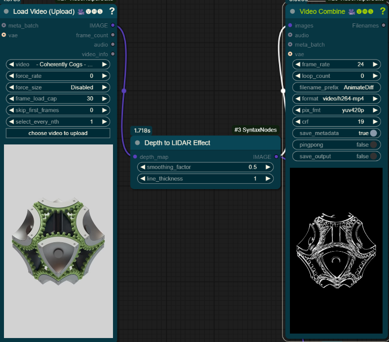 <!-- Replace with path to your example image -->

---

### Region Boundary Node

Segments the image into superpixels (regions of similar color/texture) using an algorithm like SLIC and draws the boundaries between them.

**Parameters:**
*   `image`: Input image.
*   `segments`: Target number of superpixel segments.
*   `compactness`: Balances color proximity vs. space proximity (higher means more square-like segments).
*   `line_color`: Color of the boundary lines (represented as an integer, likely BGR or RGB).

**Example:**
 <!-- Replace with path to your example image -->

---

### Beat Sync

Input a folder of same resolution videos and an input audio, the script will auto process and return a automated, edited video based on your audio input.
Turn effect intensity to max for a stronger effect within the edit. 

**Parameters:**
*   **if you want to edit a few hundred frames within comfyui select "Frames for Editing", If youd like the entire song to process the selected video folder select "Direct Video Output", this will output the entire video into your Comfyui output folder with a  "BeatSync(timestamp).mp4 file extension.  *Note* VHS combine still needs to be plugged in for "Direct Video Output"
*   (This can be helpful to process 400 frames with other nodes within Comfyui vs processing a few thousand frames for a multi minute song)

**Example:**
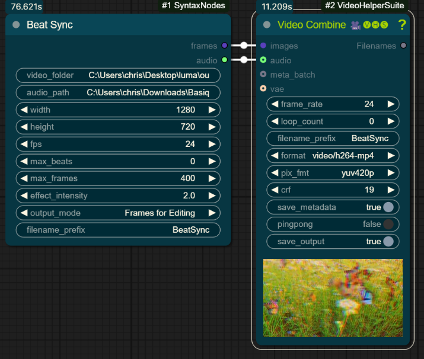 <!-- Replace with path to your example image -->

---

### Upright Person Tracking

Detects and tracks human body parts (shoulders, hips, face, hands) using pose estimation models. The output "rotates" the video or adjusts parameters to attempt to keep tracked points centered or stable. *(Note: This node was previously named `UpTrackNode`)*.

**Parameters:**
*   `image`: Input image.
*   `tracking_mode`: Specifies the model or mode (e.g., whole body, upper body).
*   `draw_shoulders`, `draw_hips`, `draw_face`, `draw_hands`: Booleans to control visualization of detected parts.
*   `inertia`: Smoothing factor for tracking over time.
*   `variance`: Parameter related to detection uncertainty or smoothing kernel.
*   `damping`: Damping factor for tracking physics/smoothing.
*   `confidence`: Minimum confidence score to accept a detection.
*   `angle_threshold`: Threshold related to pose angles.

**Example:**
 <!-- Replace with path to your example image -->

---

## Usage

1.  Load an image using a `Load Image` node or use an image output from another node.
2.  Add one of the `SyntaxNodes` (found under the "SyntaxNodes" category or by searching after right-clicking) to the canvas.
3.  Connect the `IMAGE` output from your source node to the `image` (or equivalent) input of the SyntaxNode.
4.  Adjust the parameters as needed. Check the node's tooltips in ComfyUI for specific parameter details.
5.  Connect the `IMAGE` output of the SyntaxNode to a `Preview Image` node or another processing node.

## Contributing

Contributions are welcome! Please feel free to submit pull requests or open issues for bugs, feature requests, or improvements.
