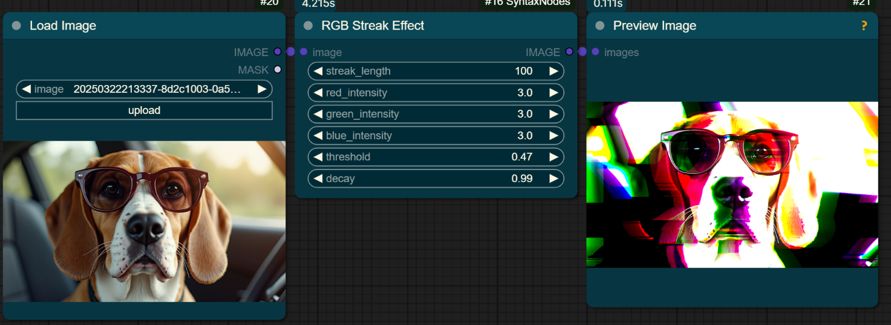
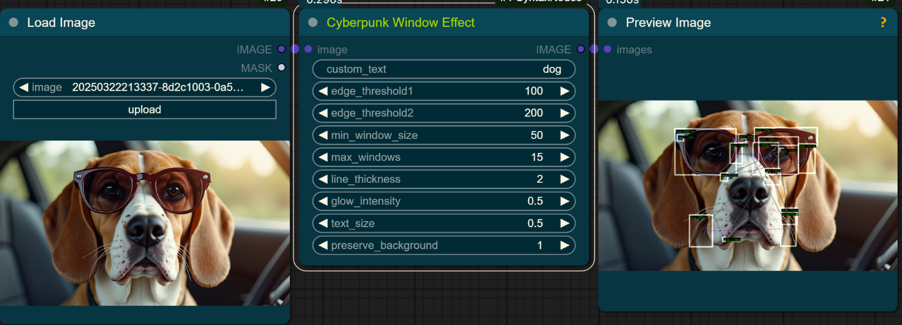
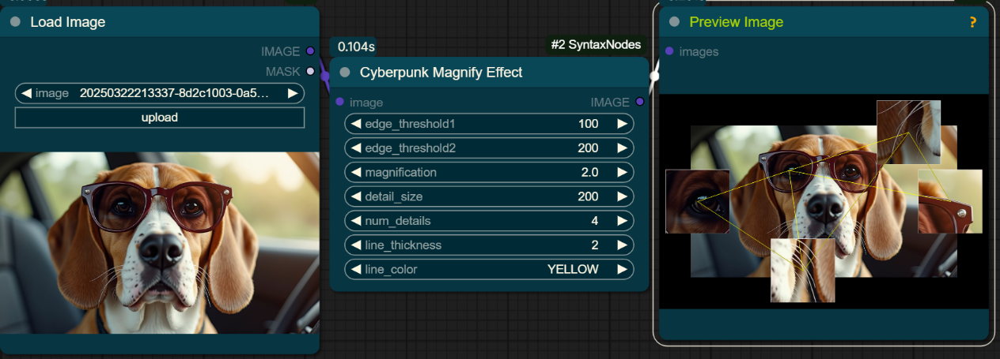
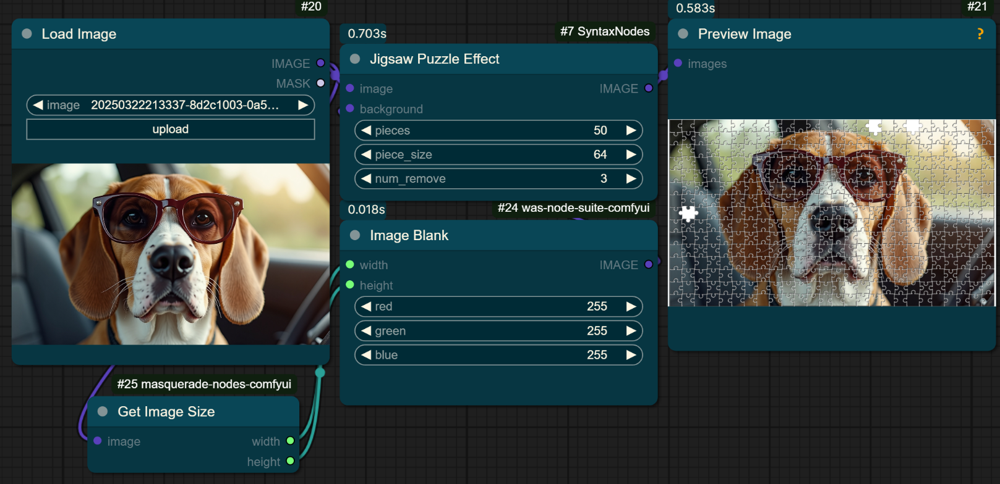
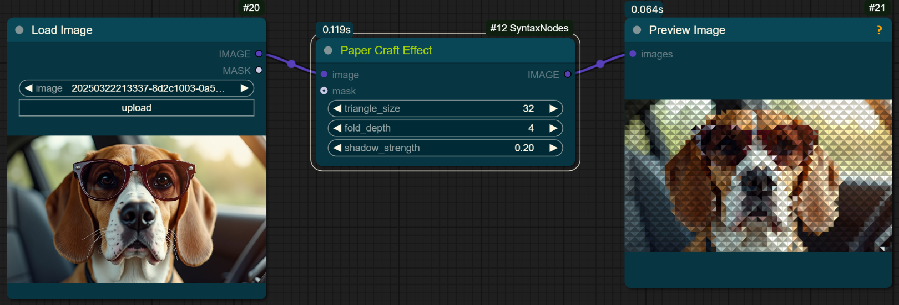
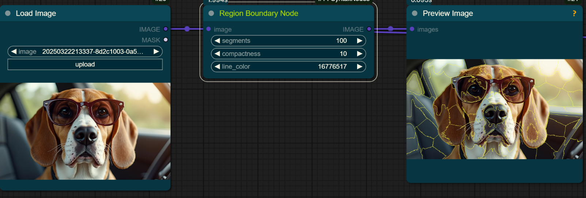

# SyntaxNodes - Image Processing Effects for ComfyUI

 <!-- Replace with path to your overview image -->

A collection of custom nodes for ComfyUI designed to apply various image processing effects, stylizations, and analyses. From glitch art and cyberpunk aesthetics to low-poly conversions and particle effects, these nodes offer a wide range of creative possibilities.

## Features

This pack includes the following nodes:

**Stylization & Effects:**

*   [Voxel Block Effect](#19-voxel-block-effect)
*   [RGB Streak Effect](#16-rgb-streak-effect)
*   [Cyberpunk Window Effect](#15-cyberpunk-window-effect)
*   [Cyberpunk Magnify Effect](#2-cyberpunk-magnify-effect)
*   [Variable Line Width Effect](#18-variable-line-width-effect)
*   [Jigsaw Puzzle Effect](#7-jigsaw-puzzle-effect)
*   [Low Poly Image Processor](#8-low-poly-image-processor)
*   [Pointillism Effect](#13-pointillism-effect)
*   [Paper Craft Effect](#12-paper-craft-effect)
*   [Ghosting/Afterimage Effect](#6-ghostingafterimage-effect)
*   [Luminance-Based Horizontal Lines](#10-luminance-based-horizontal-lines)

**Analysis & Visualization:**

*   [Edge Tracing Animation](#5-edge-tracing-animation)
*   [Edge Measurement Overlay](#4-edge-measurement-overlay)
*   [Luminance Particle Effect](#9-luminance-particle-effect)
*   [Depth to LIDAR Effect](#3-depth-to-lidar-effect)
*   [Optical Flow Particle Effect](#11-optical-flow-particle-effect)
*   [Region Boundary Node](#14-region-boundary-node)

**Utility (Potentially):**

*   [Upsight Person Tracking](#17-upsight-person-tracking) *(Note: Based on name, might be for pose estimation or specialized effects)*

## Installation

1.  Navigate to your ComfyUI `custom_nodes` directory:
    *   `cd ComfyUI/custom_nodes/`
2.  Clone this repository:
    *   `[git clone https://github.com/your-username/SyntaxNodes.git](https://github.com/dream-computing/syntax_nodes.git)` <!-- Replace with your actual repo URL -->
3.  Restart ComfyUI.

*(Optional: Add instructions for installation via ComfyUI Manager if you plan to register it there.)*

## Nodes Reference

Below are details and examples for each node:

---

### #19 Voxel Block Effect

Applies a 3D pixelated (voxel) effect to the image.

**Parameters:**
*   `image`: Input image.
*   `mask` (optional): Mask to limit the effect area.
*   `block_size`: Size of the voxel blocks.
*   `block_depth`: Depth simulation for the blocks.
*   `shading`: Amount of shading applied to simulate depth.

**Example:**
 <!-- Replace with path to your example image -->

---

### #16 RGB Streak Effect

Creates horizontal glitch-like streaks based on pixel brightness in RGB channels.

**Parameters:**
*   `image`: Input image.
*   `streak_length`: Maximum length of the streaks.
*   `red_intensity`, `green_intensity`, `blue_intensity`: Multiplier for streak length based on channel brightness.
*   `threshold`: Luminance threshold below which pixels won't generate streaks.
*   `decay`: How quickly streaks fade with distance.

**Example:**
 <!-- Replace with path to your example image -->

---

### #15 Cyberpunk Window Effect

Overlays futuristic UI window elements onto detected edges or regions of interest.

**Parameters:**
*   `image`: Input image.
*   `custom_text`: Text to display within the windows.
*   `edge_threshold1`, `edge_threshold2`: Canny edge detection thresholds.
*   `min_window_size`: Minimum size for a detected window area.
*   `max_windows`: Maximum number of windows to draw.
*   `line_thickness`: Thickness of the window borders.
*   `glow_intensity`: Intensity of the outer glow effect (if any).
*   `text_size`: Size of the displayed text.
*   `preserve_background`: Whether to keep the original image visible (1) or use a black background (0).

**Example:**
 <!-- Replace with path to your example image -->

---

### #2 Cyberpunk Magnify Effect

Creates magnified inset views ("detail windows") focusing on specific parts of the image, often highlighted by lines pointing to the original location.

**Parameters:**
*   `image`: Input image.
*   `edge_threshold1`, `edge_threshold2`: Canny edge detection thresholds (likely used to find points of interest).
*   `magnification`: Zoom factor for the detail windows.
*   `detail_size`: Size of the square detail windows.
*   `num_details`: Number of detail windows to generate.
*   `line_thickness`: Thickness of connecting lines and window borders.
*   `line_color`: Color of the connecting lines.

**Example:**
 <!-- Replace with path to your example image -->

---

### #18 Variable Line Width Effect

Draws horizontal lines across the image, displacing them vertically based on image content and varying color along the line.

**Parameters:**
*   `images`: Input image(s).
*   `mask` (optional): Mask to limit effect area.
*   `line_spacing`: Vertical distance between lines.
*   `displacement_strength`: How much image content affects vertical line position.
*   `line_thickness`: Thickness of the lines.
*   `invert`: Invert the displacement effect.
*   `color_intensity`: How strongly image color influences line color.
*   `start_color_r/g/b`: Starting color components for the gradient.
*   `end_color_r/g/b`: Ending color components for the gradient.

**Example:**
 <!-- Replace with path to your example image -->

---

### #5 Edge Tracing Animation

Visualizes image edges using animated particles that move along detected contours. *(Note: Example shows a static frame, animation occurs over time/frames)*.

**Parameters:**
*   `input_image`: Input image.
*   `low_threshold`, `high_threshold`: Canny edge detection thresholds.
*   `num_particles`: Total number of particles to simulate.
*   `speed`: Speed at which particles move along edges.
*   `edge_opacity`: Opacity of the underlying detected edges (if drawn).
*   `particle_size`: Size of the individual particles.
*   `particle_opacity`: Opacity of the particles.
*   `particle_lifespan`: How long each particle exists (relevant for animation).

**Example:**
 <!-- Replace with path to your example image -->

---

### #4 Edge Measurement Overlay

Detects contours using Canny edge detection and draws bounding boxes around them.

**Parameters:**
*   `image`: Input image.
*   `canny_threshold1`, `canny_threshold2`: Canny edge detection thresholds.
*   `min_area`: Minimum area for a contour to be considered.
*   `bounding_box_opacity`: Opacity of the drawn bounding boxes.

**Example:**
 <!-- Replace with path to your example image -->

---

### #7 Jigsaw Puzzle Effect

Transforms the image into a jigsaw puzzle grid, with options to remove pieces.

**Parameters:**
*   `image`: Input image.
*   `background` (optional): Image to use as background where pieces are removed.
*   `pieces`: Number of pieces along one dimension (total pieces = `pieces` * `pieces`).
*   `piece_size`: Size of each puzzle piece (may override `pieces` or work with it).
*   `num_remove`: Number of random pieces to remove.

**Example:**
 <!-- Replace with path to your example image -->

---

### #9 Luminance Particle Effect

Generates particles whose distribution and possibly appearance are based on the luminance (brightness) of the input image/depth map.

**Parameters:**
*   `depth_map`: Input image (interpreted as brightness/depth).
*   `num_layers`: Number of depth layers for particle generation.
*   `smoothing_factor`: Smoothing applied to the input map.
*   `particle_size`: Size of the particles.
*   `particle_speed`: Speed factor (likely for animation).
*   `num_particles`: Total number of particles.
*   `particle_opacity`: Opacity of the particles.
*   `edge_opacity`: Opacity for edge enhancement.
*   `particle_lifespan`: Duration particles exist (for animation).

**Example:**
 <!-- Replace with path to your example image -->

---

### #8 Low Poly Image Processor

Converts the image into a stylized low-polygon representation using Delaunay triangulation.

**Parameters:**
*   `image`: Input image.
*   `num_points`: Number of initial points for triangulation.
*   `num_points_step`: Step related to point density or refinement.
*   `edge_points`: Number of points placed along detected edges.
*   `edge_points_step`: Step related to edge point density.

**Example:**
 <!-- Replace with path to your example image -->

---

### #13 Pointillism Effect

Recreates the image using small dots of color, mimicking the Pointillist art style.

**Parameters:**
*   `image`: Input image.
*   `dot_radius`: Radius of the individual dots.
*   `dot_density`: Number of dots to generate (higher means denser).

**Example:**
 <!-- Replace with path to your example image -->

---

### #12 Paper Craft Effect

Applies a filter that makes the image look like it's constructed from folded geometric triangles.

**Parameters:**
*   `image`: Input image.
*   `mask` (optional): Mask to limit the effect area.
*   `triangle_size`: Size of the triangular facets.
*   `fold_depth`: Intensity of the simulated folds/shading between triangles.
*   `shadow_strength`: Strength of the drop shadow effect.

**Example:**
 <!-- Replace with path to your example image -->

---

### #14 Region Boundary Node

Segments the image into superpixels (regions of similar color/texture) using an algorithm like SLIC and draws the boundaries between them.

**Parameters:**
*   `image`: Input image.
*   `segments`: Target number of superpixel segments.
*   `compactness`: Balances color proximity vs. space proximity (higher means more square-like segments).
*   `line_color`: Color of the boundary lines (represented as an integer, likely BGR or RGB).

**Example:**
 <!-- Replace with path to your example image -->

---

### #3 Depth to LIDAR Effect

Simulates a LIDAR scan visualization based on a depth map input (brighter areas treated as closer). Often used with 3D renders or actual depth data.

**Parameters:**
*   `depth_map`: Input depth map (or image to interpret as depth).
*   `smoothing_factor`: Smoothing applied to the depth map.
*   `line_thickness`: Thickness of the scan lines.

**Example:**
 <!-- Replace with path to your example image -->

---

### #6 Ghosting/Afterimage Effect

*(No example screenshot provided)*

Creates trailing or faded copies of the image, simulating motion blur or afterimages.

**Parameters:**
*   `image`: Input image.
*   `mask` (optional): Mask to limit effect area.
*   `decay_rate`: How quickly the ghost images fade.
*   `offset`: Displacement of the ghost images.
*   `buffer_size`: Number of previous frames/states to use for ghosting.

---

### #10 Luminance-Based Horizontal Lines

*(No example screenshot provided)*

Draws horizontal lines across the image whose characteristics (e.g., waviness, opacity) are modulated by the image's luminance.

**Parameters:**
*   `image`: Input image.
*   `mask` (optional): Mask to limit effect area.
*   `amplitude`: Maximum vertical displacement (waviness) of the lines.
*   `oscillation_amplitude`: Frequency of the line oscillations.
*   `line_opacity`: Base opacity of the lines.
*   `effect_opacity`: How much luminance affects the final opacity/visibility.

---

### #17 Upsight Person Tracking

Detects and tracks human body parts (shoulders, hips, face, hands) using pose estimation models. The output "rotates" the video to attempt to keep them centered.

**Parameters:**
*   `image`: Input image.
*   `tracking_mode`: Specifies the model or mode (e.g., whole body, upper body).
*   `draw_shoulders`, `draw_hips`, `draw_face`, `draw_hands`: Booleans to control visualization of detected parts.
*   `inertia`: Smoothing factor for tracking over time.
*   `variance`: Parameter related to detection uncertainty or smoothing kernel.
*   `damping`: Damping factor for tracking physics/smoothing.
*   `confidence`: Minimum confidence score to accept a detection.
*   `angle_threshold`: Threshold related to pose angles.

---

## Usage

1.  Load an image using a `Load Image` node or use an image output from another node.
2.  Add one of the `SyntaxNodes` (found under the "SyntaxNodes" category or by searching after right-clicking) to the canvas.
3.  Connect the `IMAGE` output from your source node to the `image` (or equivalent) input of the SyntaxNode.
4.  Adjust the parameters as needed.
5.  Connect the `IMAGE` output of the SyntaxNode to a `Preview Image` node or another processing node.

## Dependencies

*   ComfyUI
*   Likely dependencies: `numpy`, `opencv-python`, `scipy`, `scikit-image` (These are common in ComfyUI environments, but confirm if any *extra* non-standard libraries are needed).

## Contributing

Contributions are welcome! Please feel free to submit pull requests or open issues for bugs, feature requests, or improvements.
